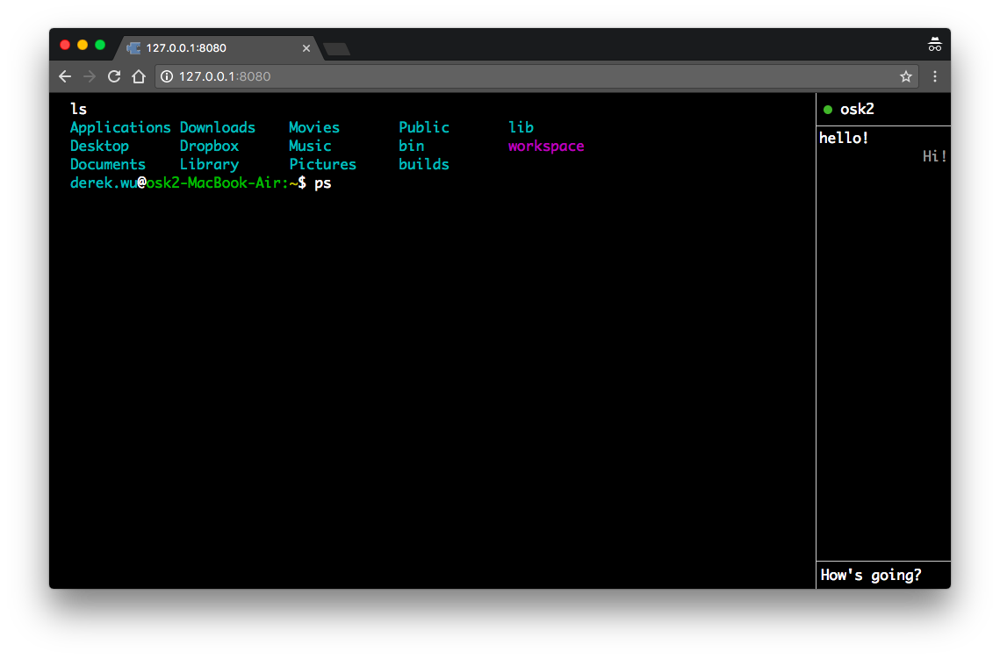

# BrowserBash

Realtime collaborative terminal with chat enabled.



## Installation

Clone the repo first
```
git clone https://github.com/osk2/browserbash
```

Make sure you have Node.js installed, and

```
npm install
```

## Run

```
node .
```

Server will start listening on port 8080

## Note

Some commands are banned due to security issue

#### List of banned commands

- `login`
- `logout`
- `exit`
- `sudo`
- `su`


## License

This project is licensed under MIT, see [LICENSE](LICENSE) for detail
