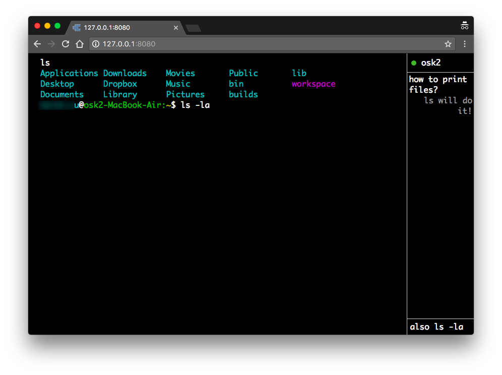

# BrowserBash

Realtime collaborative terminal with chat enabled.



## Features

> This project is forked from [melvinroest/browserbash](https://github.com/melvinroest/browserbash), differences are shown below

- Converted ANSI to HTML that can display ANSI colors correctly
- Sync input to every clients, clients can see what others are typing
- Realtime chat
- Banned some keyword due to security reason
- Use basic auth
- `clear` can actually clear screen

## Installation

Clone the repo first

```
git clone https://github.com/osk2/browserbash
```

Make sure you have Node.js installed. Run following command inside project directory

```
npm install
```

## Usage

```
node .
```

Server will start listening on default port 5566

Port can be changed in [config.js](config.js)

### Docker

If you are using Docker, you may want to try my Docker image

```
docker pull osk2/browserbash
```

See [Dockerfile](Dockerfile) for detail of image.

## Note

Some commands are banned due to security issue

#### List of banned commands

- `login`
- `logout`
- `exit`
- `sudo`
- `su`


## License

This project is licensed under the MIT license.

Please read [LICENSE](LICENSE) for more information.
